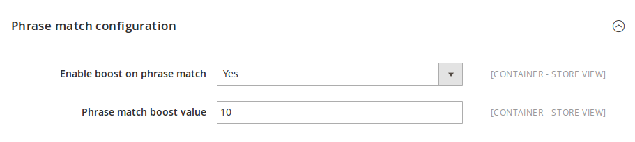
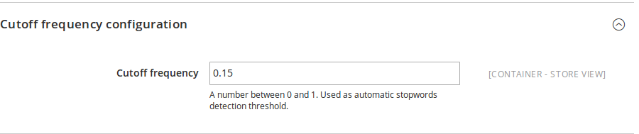
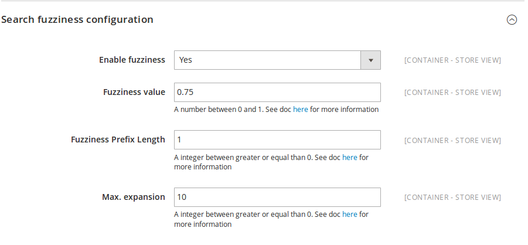
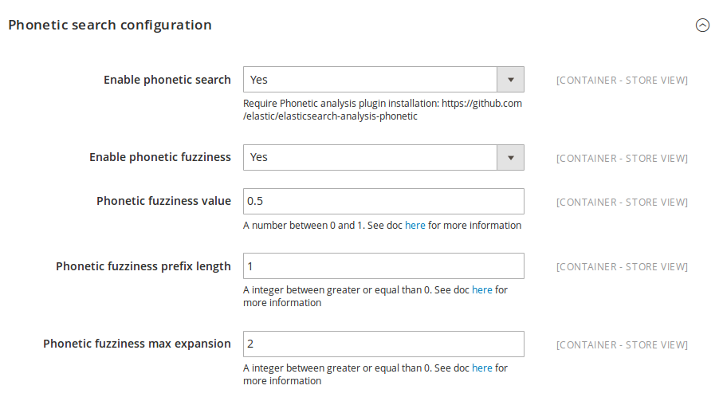
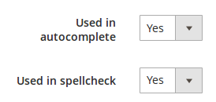
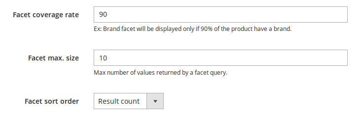

# Magento ElasticSuite Documentation

# Install

## Requirements

* ElasticSearch 2.1 or higher
* Magento 2.0.2 or higher

## Install the ElasticSuite through composer :

```bash
composer install smile-sa/elasticsuite-full
```

**Note :**
The command above will install the full ElasticSuite distribution.

All components are available individually and you can compose your own distribution :

Component                 | Package name                          |Description
--------------------------|---------------------------------------|------------
**ElasticSuite Core**     | `smile-sa/module-elasticsuite-code`   | Provides all ElasticSuite core features (ElasticSearch client, base configuration, ...). Required by most module into the suite.
**ElastiscSuite Catalog** | `smile-sa/module-elasticsuite-catalog`| Provides ElasticSuite catalog search and navigation base features.

## Enable the module  and run ElasticSuite setup:

```bash
bin/magento module:enable Smile_ElasticSuiteCore Smile_ElasticSuiteCatalog
bin/magento setup:upgrade
```

## Configure ElasticSearch server :

You can configure your ElasticSearch server via *Stores > Configuration > Smile Elastic Suite > Base Settings*


### ElasticSearch Client

Parameter                  | Default value  | Description
---------------------------|----------------|------------
ElasticSearch servers list | localhost:9200 | This a comma-separated list of servers in the [host]:[port] format where you should indicate all your ElasticSearch nodes. E.g. : "es-node1.fqdn:9200, es-node2.fqdn:9200".
Enable debug mode          |             No | When this parameter is set to "Yes", the module produces logs through the Magento logging system.
Server connection timeout  |             1  | In seconds, the default timeout used when querying the server.

### Indices Settings

Parameter                    | Default value           | Description
-----------------------------|-------------------------|------------
Indices alias name           |                magento2 | The default alias put by the module on Magento's related indices. <br/><br/> An alias per store and entity type will be generated with the following format : [indices_alias_name]\_[store_code]\_[entity_type]. <br/><br/> E.g. : magento2_default_catalog_product.
Indices name pattern         | {{YYYYMMdd}}_{{HHmmss}} | The horodated pattern used when creating new index.<br/><br/> An index name per store and entity type, based on the horodated pattern, will be generated with the following format : [indices_alias_name]\_[store_code]\_[entity_type]\_[horodated_pattern]. <br/><br/> The E.g. : magento2_default_catalog_product_20160304_094708.
Number of shards per index   |                       1 | The number of shards per index. A shard is a single Lucene instance and they are distributed by ElasticSearch amongst all nodes in the cluster. <br/><br/> You can see the Shard definition on the [ElasticSearch glossary](https://www.elastic.co/guide/en/elasticsearch/reference/current/glossary.html#glossary-shard) for more informations.
Number of replicas per index |                       0 | The number of replicas shards per index. Main purposes of replica shards is for failover : if the node holding a primary shard dies, a replica is promoted to the role of primary. <br/><br/> You can read more about Replica Shards on the [ElasticSearch documentation](https://www.elastic.co/guide/en/elasticsearch/guide/current/replica-shards.html).

## Configure ElasticSuite as Magento Search Engine :

You can configure Magento to use Smile ElasticSuite as search engine via *Stores > Configuration > Catalog > Catalog Search*


Parameter                  | Default value  | Description
---------------------------|----------------|------------
Minimal Query Length       |              1 | The minimal search query length to be processed by the engine.
Maximum Query Length       |            128 | The maximum search query length to be processed by the engine.
Search Engine              |          MySQL | The default Search Engine used by Magento. **Set it to Smile ElasticSuite to use it as Search Engine.**

## Process first indexing :

Once you have completed the 2 previous points, you can process a full reindexing of the **catalogsearch_fulltext** index.

```bash
bin/magento index:reindex catalogsearch_fulltext
```

Once the reindex is done, you are all set and can view your frontend catalog and search pages being rendered via Smile Elastic Suite !

# User guide

### Search engine & navigation

TODO : intro.

#### **Fulltext search relevance**

Search relevance configuration is editable via a dedicated screen in the back-office.

It can be accessed under the **Stores** menu, via the **Search Relevance** entry.

You can manage several parameters here :

##### **Phrase match configuration**

Phrase matching enables you to apply a boost on documents that contains *all* of your search terms, in the *same position* relative to each others.

You can learn more about phrase matching on the official documentation here : [ElasticSearch Phrase Matching](https://www.elastic.co/guide/en/elasticsearch/guide/current/phrase-matching.html)



Parameter                    | Default value  | Description
-----------------------------|----------------|------------
Enable boost on phrase match |            Yes | Set to "Yes" to enable phrase match.
Phrase match boost value     |             10 | The boost that will be applied on documents considered as matches.

##### **Cutoff Frequency**

Cutoff Frequency allows specifying an arbitrary frequency where high frequency terms (above the cutoff) are not scored for each query.
This is used as an **automatic stopwords detection** based on their frequency in index.

You can go further with the official documentation here : [ElasticSearch Cutoff Frequency](https://www.elastic.co/guide/en/elasticsearch/reference/current/query-dsl-match-query.html#query-dsl-match-query-cutoff)



Parameter                    | Default value  | Description
-----------------------------|----------------|------------
Cutoff Frequency             |           0.15 | The cutoff frequency value, as a float number between 0 and 1.

##### **Fuzziness Configuration**

Fuzzy queries uses a distance algorithm to calculate matching terms within a specified edit distance related to the current search terms.
This is used as a **spellchecking feature**.

See also the official documentation here : [ElasticSearch Fuzzy Query](https://www.elastic.co/guide/en/elasticsearch/reference/current/query-dsl-fuzzy-query.html#query-dsl-fuzzy-query)



Parameter                    | Default value  | Description
-----------------------------|----------------|------------
Enable fuzziness             |           Yes  | Set it to "Yes" to enable fuzzy queries to the engine.
Fuzziness value              |           0.75 | The maximum edit distance for a fuzzy query. More informations in [the fuzzy query documentation](https://www.elastic.co/guide/en/elasticsearch/reference/current/query-dsl-fuzzy-query.html#_parameters_7).
Fuzziness Prefix Length      |              1 | The number of initial characters that must not be "fuzzified". More informations in [the fuzzy query documentation](https://www.elastic.co/guide/en/elasticsearch/reference/current/query-dsl-fuzzy-query.html#_parameters_7).
Fuzziness Max. expansion     |             10 | Maximum number of terms the fuzzy query will expand to. More informations in [the fuzzy query documentation](https://www.elastic.co/guide/en/elasticsearch/reference/current/query-dsl-fuzzy-query.html#_parameters_7).

##### **Phonetic Search Configuration**

**This requires the Phonetic Analysis Plugin : [Phonetic Analysis Plugin] (https://github.com/elastic/elasticsearch/tree/master/plugins/analysis-phonetic)**

Phonetic search provides a variety of filters that convert tokens to their phonetic representation.

Phonetic search can be also improved with fuzziness. The parameters are used the same way as described above.

Official documentation related to phonetic search : [ElasticSearch Phonetic Search](https://www.elastic.co/guide/en/elasticsearch/plugins/master/analysis-phonetic.html)



Parameter                             | Default value  | Description
--------------------------------------|----------------|------------
Enable phonetic search                |           Yes  | Set it to "Yes" to enable phonetic search.
Enable fuzziness                      |           Yes  | Set it to "Yes" to enable phonetic fuzziness.
Phonetic fuzziness value              |            0.5 | The maximum edit distance for a phonetic fuzzy query. More informations in [the fuzzy query documentation](https://www.elastic.co/guide/en/elasticsearch/reference/current/query-dsl-fuzzy-query.html#_parameters_7).
Phonetic fuzziness Prefix Length      |              1 | The number of initial characters that must not be "fuzzified". More informations in [the fuzzy query documentation](https://www.elastic.co/guide/en/elasticsearch/reference/current/query-dsl-fuzzy-query.html#_parameters_7).
Phonetic fuzziness Max. expansion     |             10 | Maximum number of terms the phonetic fuzzy query will expand to. More informations in [the fuzzy query documentation](https://www.elastic.co/guide/en/elasticsearch/reference/current/query-dsl-fuzzy-query.html#_parameters_7).


##### **Per Attribute Relevance**

For each product attribute, on the attribute edition page on the Magento back-office, several parameters can be fine tuned to fit your needs :



Parameter                    | Default value  | Description
-----------------------------|----------------|------------
Used in autocomplete         |            Yes | If the attribute values are used to build the autocomplete results.
Used in spellcheck           |            Yes | If the values of this attributes will be candidate for spellchecking when processing a search query.

#### **Faceting configuration**

Each product attribute can also be configured when it is used as a facet in the search results and/or category view page.

On the attribute edition page in Magento back-office, following parameters can be modified :



Parameter                    | Default value  | Description
-----------------------------|----------------|------------
Facet coverage rate          |             90 | The minimum coverage rates of results by this attribute. <br/> Example, if set to 90% on the "Brand" attribute, the facet will be displayed only if 90% of the products in the search results or category have a brand.
Facet max. size              |             10 | The maximum number of values that will be displayed for this facet.
Facet sort order             |   Result count | This is how the facet values will be ordered.

Facet sort order options :

Option       | Description
-------------|---------------
Result count | Will order values according to their number of results (descending).
Admin sort   | Values will be displayed as ordered in attribute's options values in Magento back-office.
Name         | Values will be displayed alphabetically (ascending).
Relevance    | Values are displayed by relevance.
