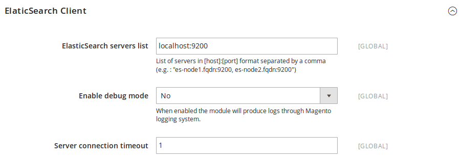
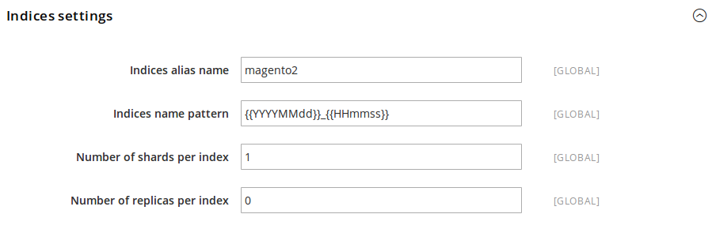
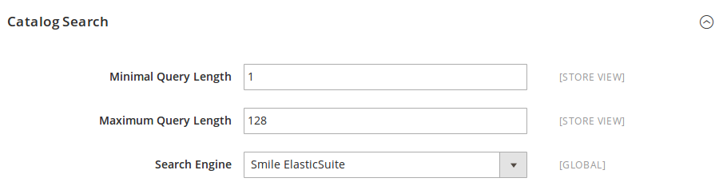

# Install

## Requirements

* ElasticSearch 2.1 or higher
* Magento 2.0.2 or higher

## Install the ElasticSuite through composer :

```bash
composer install smile-sa/elasticsuite-full
```

**Note :**
The command above will install the full ElasticSuite distribution.

All components are available individually and you can compose your own distribution :

Component                 | Package name                          |Description
--------------------------|---------------------------------------|------------
**ElasticSuite Core**     | `smile-sa/module-elasticsuite-code`   | Provides all ElasticSuite core features (ElasticSearch client, base configuration, ...). Required by most module into the suite.
**ElastiscSuite Catalog** | `smile-sa/module-elasticsuite-catalog`| Provides ElasticSuite catalog search and navigation base features.

## Enable the module  and run ElasticSuite setup:

```bash
bin/magento module:enable Smile_ElasticSuiteCore Smile_ElasticSuiteCatalog
bin/magento setup:upgrade
```

## Configure ElasticSearch server :

You can configure your ElasticSearch server via *Stores > Configuration > Smile Elastic Suite > Base Settings*



### ElasticSearch Client

Parameter                  | Default value  | Description
---------------------------|----------------|------------
ElasticSearch servers list | localhost:9200 | This a comma-separated list of servers in the [host]:[port] format where you should indicate all your ElasticSearch nodes. E.g. : "es-node1.fqdn:9200, es-node2.fqdn:9200".
Enable debug mode          |             No | When this parameter is set to "Yes", the module produces logs through the Magento logging system.
Server connection timeout  |             1  | In seconds, the default timeout used when querying the server.

### Indices Settings



Parameter                    | Default value           | Description
-----------------------------|-------------------------|------------
Indices alias name           |                magento2 | The default alias put by the module on Magento's related indices. <br/><br/> An alias per store and entity type will be generated with the following format : [indices_alias_name]\_[store_code]\_[entity_type]. <br/><br/> E.g. : magento2_default_catalog_product.
Indices name pattern         | {{YYYYMMdd}}_{{HHmmss}} | The horodated pattern used when creating new index.<br/><br/> An index name per store and entity type, based on the horodated pattern, will be generated with the following format : [indices_alias_name]\_[store_code]\_[entity_type]\_[horodated_pattern]. <br/><br/> The E.g. : magento2_default_catalog_product_20160304_094708.
Number of shards per index   |                       1 | The number of shards per index. A shard is a single Lucene instance and they are distributed by ElasticSearch amongst all nodes in the cluster. <br/><br/> You can see the Shard definition on the [ElasticSearch glossary](https://www.elastic.co/guide/en/elasticsearch/reference/current/glossary.html#glossary-shard) for more informations.
Number of replicas per index |                       0 | The number of replicas shards per index. Main purposes of replica shards is for failover : if the node holding a primary shard dies, a replica is promoted to the role of primary. <br/><br/> You can read more about Replica Shards on the [ElasticSearch documentation](https://www.elastic.co/guide/en/elasticsearch/guide/current/replica-shards.html).

## Configure ElasticSuite as Magento Search Engine :

You can configure Magento to use Smile ElasticSuite as search engine via *Stores > Configuration > Catalog > Catalog Search*



Parameter                  | Default value  | Description
---------------------------|----------------|------------
Minimal Query Length       |              1 | The minimal search query length to be processed by the engine.
Maximum Query Length       |            128 | The maximum search query length to be processed by the engine.
Search Engine              |          MySQL | The default Search Engine used by Magento. **Set it to Smile ElasticSuite to use it as Search Engine.**

## Process first indexing :

Once you have completed the 2 previous points, you can process a full reindexing of the **catalogsearch_fulltext** index.

```bash
bin/magento index:reindex catalogsearch_fulltext
```

Once the reindex is done, you are all set and can view your frontend catalog and search pages being rendered via Smile Elastic Suite !
